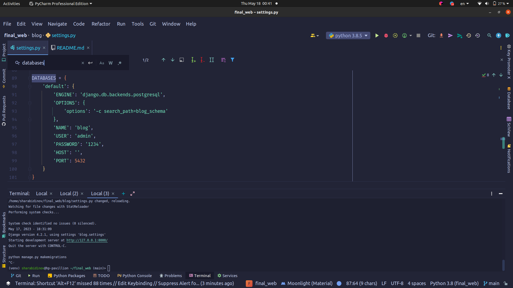
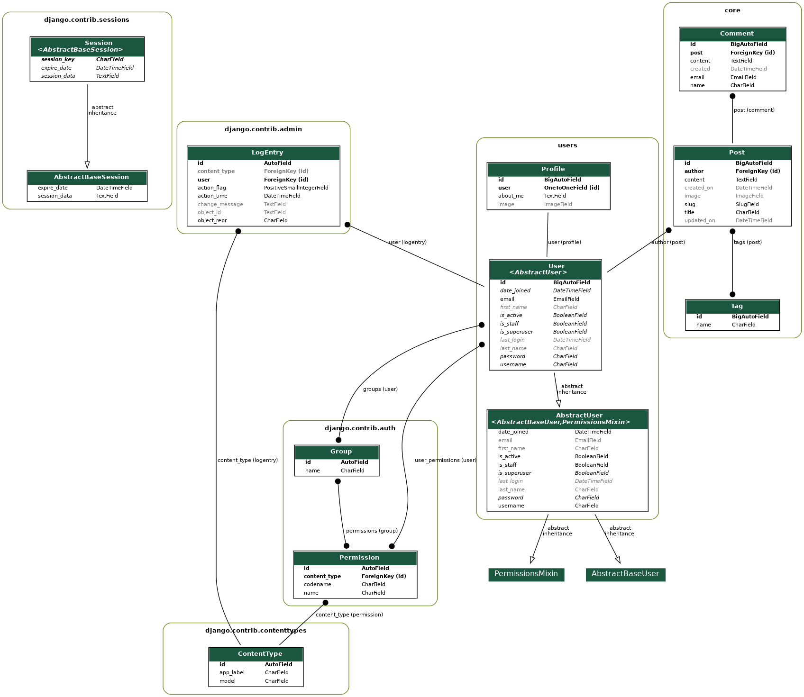

# Final web project
link to the [deployment](https://ala-too-final.herokuapp.com/)
link to the [video](https://youtu.be/W1aRoH6WdVM)
### Django blog web-app info and quick start

* Dependencies:
  * ```python 3.8.10```
  * ``` ubuntu 20.04 lts ```
  * ``` postgresql 12 ``` there might be issues on ubuntu related with db, please [read this](https://gist.github.com/axelbdt/74898d80ceee51b69a16b575345e8457)
  * ``` requirements.txt ```

- How to start app:
  - Clone repository
  - Open via IDE
  - Create venv
  - ```pip install requirements.txt```
  - ```python manage.py makemigrations```
  - ```python manage.py migrate```
  - ```python manage.py createsuperuser```
  - ```python manage.py runserver```

## database type and ERD image
You can find erd image in img directory
```
from django.db import connection
print(connection.vendor)

postgresql
```


## Screenshots


